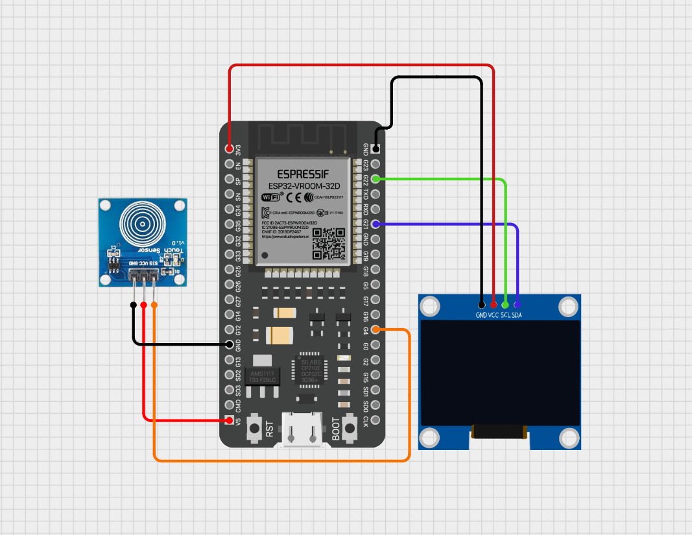
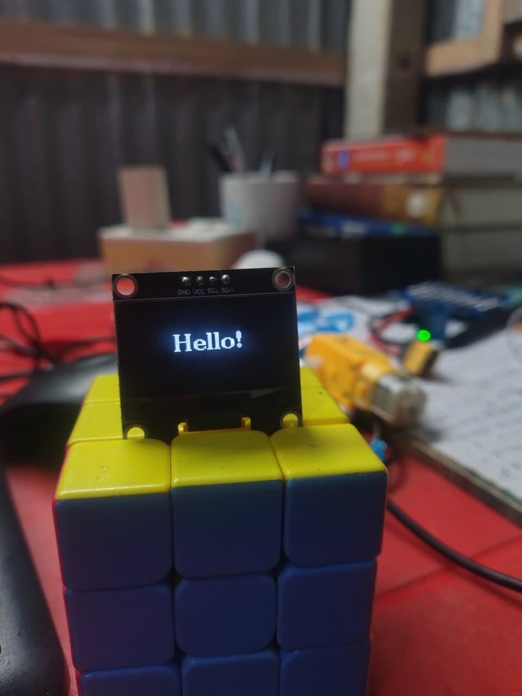
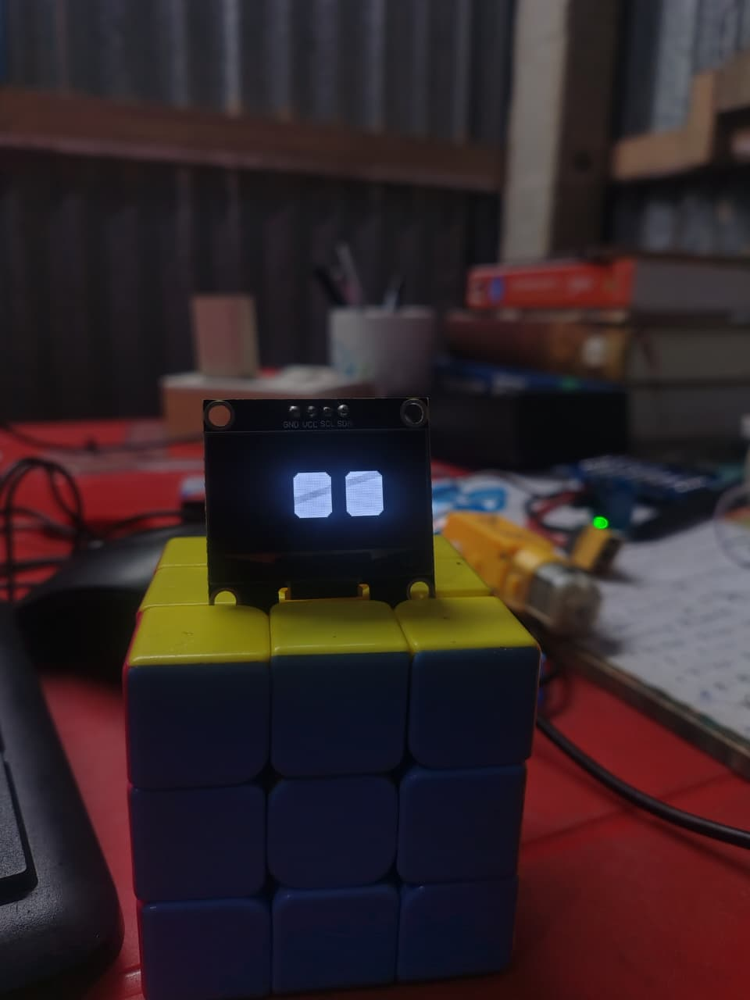
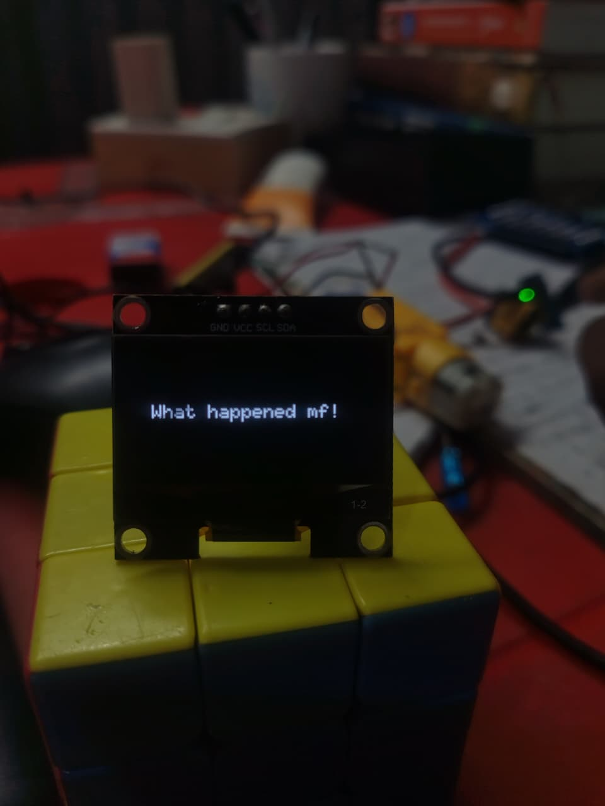
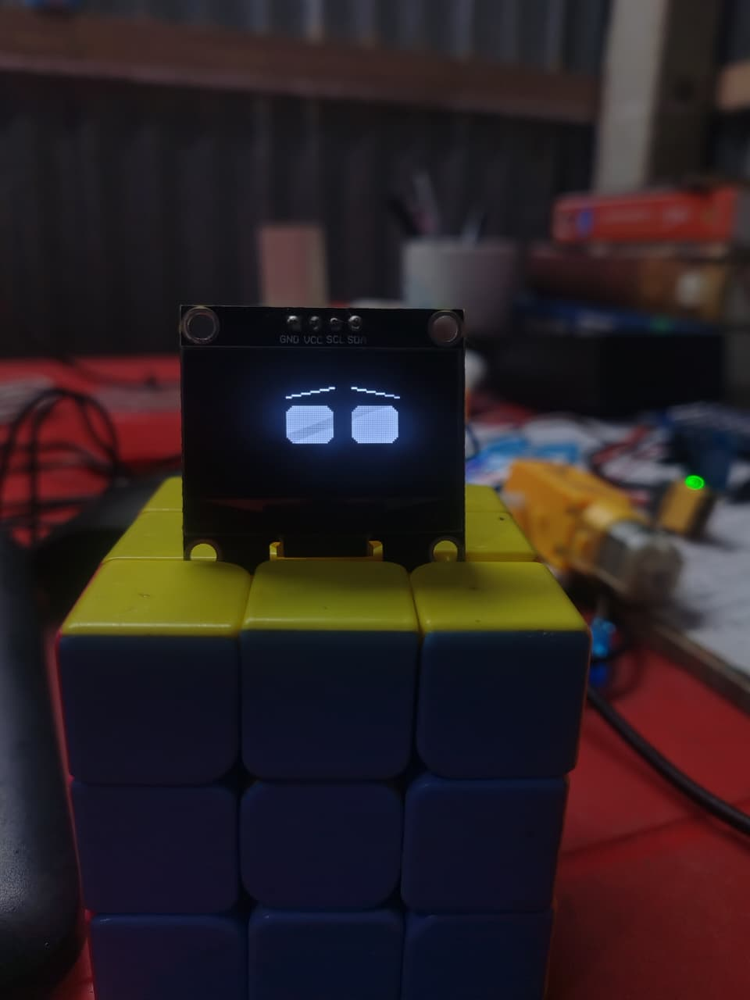
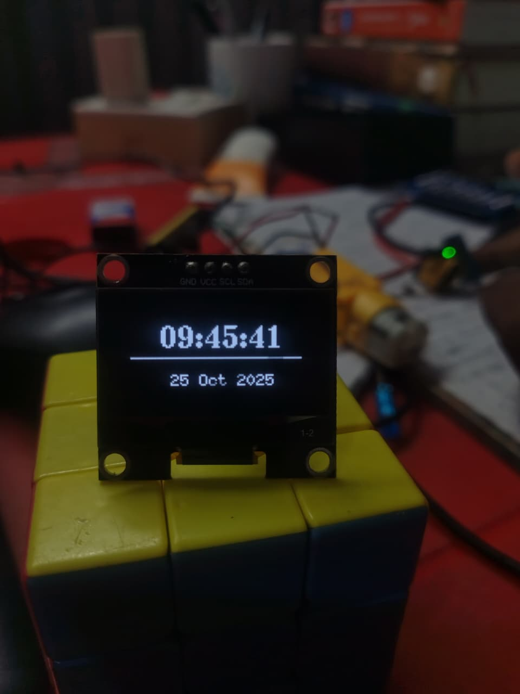

# ESP32 + SH1106 OLED Display Project

A beginner-friendly ESP32 project to display **real-time information** on a SH1106 OLED display. This project can show **time, date, weather, animations, and interactive modes**.

---

## 📌 Features
- Display **current time and date** using Wi-Fi (NTP)  
- Show **weather information** (temperature, humidity, description)  
- Display **Wi-Fi status and IP address**  
- Display **animations** like basic eye or angry mode  
- Interactive OLED: actions when holding/touching the screen  

---

## 📷 Project Images & Descriptions

### 1️⃣ Wiring Diagram
  
*Shows all the pin connections between the ESP32 and the SH1106 OLED.*

## 🔌 Connections

| OLED Pin | ESP32 Pin |
|----------|-----------|
| VCC      | 3.3V      |
| GND      | GND       |
| SDA      | D21       |
| SCL      | D22       |

> Note: SH1106 commonly uses I²C address `0x3C`. Confirm your display’s address.

---

### 2️⃣ Hello World Display
  
*Initial test display to verify the OLED is working.*

---

### 3️⃣ Basic Eye Animation
  
*A simple animation demonstrating the graphics capabilities of the OLED.*

---

### 4️⃣ Touch for a short time
  
*OLED displays the current time when a touch or hold action is detected.*

---

### 5️⃣ Angry Mode Animation
  
*Interactive angry mode animation on the OLED.*

---

### 6️⃣ Time & Date Display
  
*Full date and time display using NTP.*

---

## 🛠️ Setup Steps
1. Connect the hardware according to the table above.
2. Install required Arduino IDE libraries:  
   - **U8g2**  
   - **WiFi** (built-in for ESP32)  
   - **HTTPClient**  
   - **ArduinoJson**
3. Connect ESP32 to Wi-Fi.
4. Upload your `.ino` file to the ESP32.
5. Observe the OLED displaying **animations, time, date, and interactions**.

---
